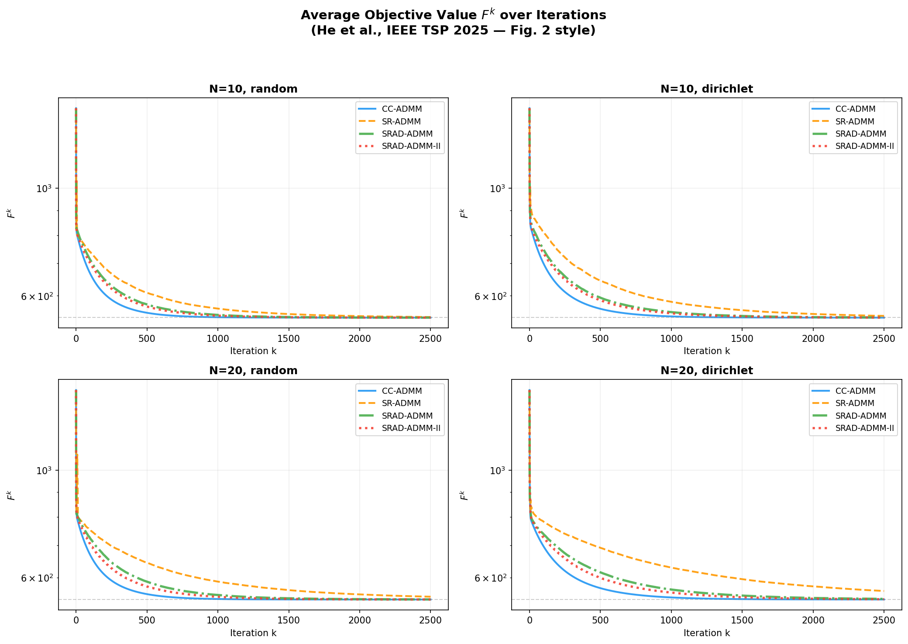
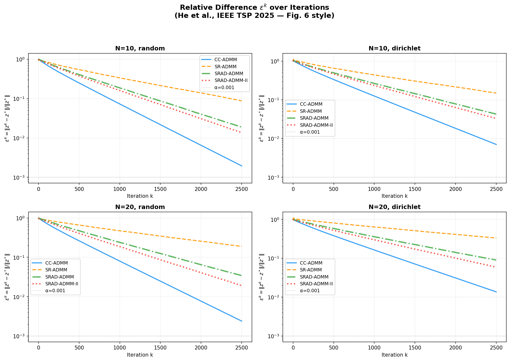
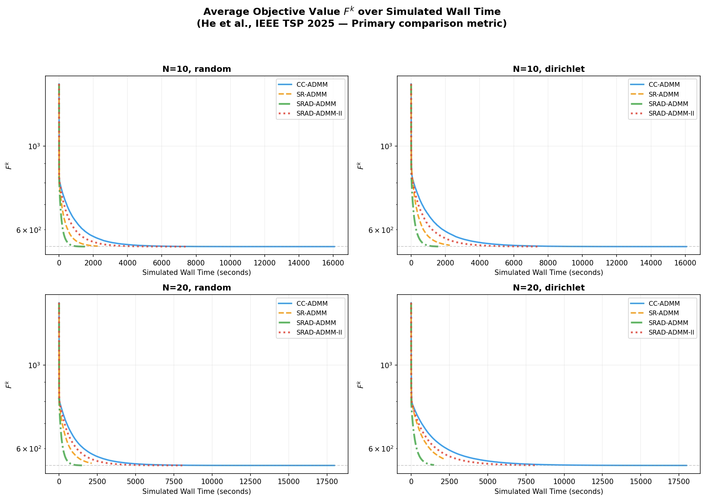

# SRAD-ADMM: Straggler-Resilient Asynchronous Distributed ADMM

This repository contains simulations for various **Distributed ADMM (Alternating Direction Method of Multipliers)** algorithms, focusing on their resilience to **stragglers** (slow computing nodes) in a distributed learning environment.

**Reference:** Straggler-Resilient Asynchronous ADMM for Distributed Consensus Optimization, J He, M Xiao, M Skoglund, HV Poor — *IEEE Transactions on Signal Processing, 2025*

## 🧪 Implemented Algorithms

The simulation compares four distinct ADMM variants:

1.  **CC-ADMM (Coded Computation ADMM) / Standard ADMM**
    *   **Synchronous**: The central server waits for **all** $N$ worker nodes to complete their updates.
    *   **Straggler Sensitivity**: High. The system speed is dictated by the slowest node.

2.  **SR-ADMM (Straggler-Resilient ADMM)**
    *   **Relaxed Synchronous**: The server waits only for the fastest $N_{min}$ nodes (e.g., subset of $N$) and ignores the rest for the current iteration.
    *   **Pros**: Faster per-iteration time than CC-ADMM.
    *   **Cons**: Potential information loss from discarded updates.

3.  **SRAD-ADMM (Straggler-Resilient Asynchronous Distributed ADMM)**
    *   **Asynchronous**: Removes the synchronization barrier entirely.
    *   **Mechanism**: Workers update at their own pace. The global model is updated incrementally upon receiving any worker's output.
    *   **Pros**: Maximizes resource utilization; robust to heterogeneous and time-varying delays.

4.  **SRAD-ADMM II**
    *   **Asynchronous + Time Tracking**: An enhanced version of SRAD-ADMM that incorporates time-tracking mechanisms or adaptive weights to further stabilize convergence.

## 📂 Repository Structure

*   **`src/`**: Source code for the algorithms and simulations.
    *   `run_all.py`: **[Main Script]** Runs all 4 algorithms concurrently and generates comparison plots.
    *   `cc_admm.py`: Implementation of Standard/CC-ADMM.
    *   `sr_admm.py`: Implementation of SR-ADMM.
    *   `srad_admm.py`: Implementation of SRAD-ADMM.
    *   `srad_admm_ii.py`: Implementation of SRAD-ADMM II.
    *   `common.py`: Shared utilities for data generation and metrics.
*   **`src/results/`**: Output directory for generated plots.
    *   `fig_objective.png`: Objective function value ($F^k$) vs Iterations.
    *   `fig_convergence.png`: Relative error ($\epsilon^k$) vs Iterations.
    *   `fig_walltime.png`: Objective function value ($F^k$) vs Wall Time.
    *   `fig_eps_walltime.png`: Relative error ($\epsilon^k$) vs Wall Time.

## 🚀 How to Run

1.  **Navigate to the source directory:**
    ```bash
    cd src
    ```

2.  **Run the full comparison simulation:**
    ```bash
    python run_all.py
    ```
    This will execute the simulations for different network configurations and save the resulting plots to the `src/results/` folder.

## 📊 Results Summary

The simulations demonstrate the effectiveness of SRAD-ADMM in heterogeneous computing environments with stragglers.

### 1. Objective Function vs. Iteration ($F^k$)
This metric shows how the global objective value decreases with the number of communication rounds (iterations).



*   **Observation**: All algorithms reduce the objective function value effectively. Standard ADMM (CC-ADMM) often requires fewer *iterations* to reach a certain accuracy because it waits for full synchronization, ensuring high-quality updates at each step. SRAD-ADMM variants may take more iterations due to the use of stale or partial gradients, but they do not block progress.

### 2. Convergence vs. Iteration ($\epsilon^k$)

This plot shows the relative error $\left\lVert\mathbf{z}^k-\mathbf{z}^*\right\rVert / \left\lVert\mathbf{z}^*\right\rVert$ against iterations.



*   **Observation**: Similar to the objective function, synchronous methods appear more stable per iteration. Asynchronous methods (SRAD-ADMM) show a slightly more fluctuating convergence path but still steadily approach the optimal solution.

### 3. Objective Function vs. Wall-Clock Time (Critical Metric)
This is the most critical comparison for distributed systems. It measures performance against actual elapsed time, accounting for straggler delays.



*   **Straggler Impact**: In CC-ADMM (Standard ADMM), the system freezes until the slowest node completes its update. This causes "step-like" plateaus in the convergence graph.
*   **SRAD-ADMM Advantage**: The asynchronous nature allows the global model to update continuously. Even if some nodes are slow, the aggregate model improves using updates from faster nodes. This results in a significantly steeper (faster) drop in the objective value over time.

### 4. Convergence vs. Wall-Clock Time
Relative error reduction over real time.


*   **Conclusion**: **SRAD-ADMM achieves the target accuracy much faster than synchronous CC-ADMM and the semi-synchronous SR-ADMM.** This confirms that for time-sensitive applications distributed over heterogeneous networks, removing the synchronization barrier is highly beneficial.

