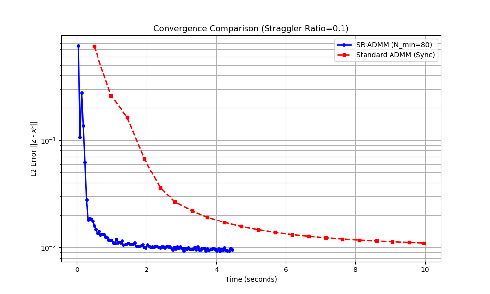

# SR-ADMM Verification Results

## 1. Synchronization Fix
Fixed a critical bug where Worker nodes were misinterpreting the global iteration count $k$, leading to immediate message rejection by the Central node.
- **Before**: Simulation stalled at Iteration 1.
- **After**: Simulation completes all iterations successfully.

## 2. Convergence Analysis
We implemented real-time error tracking $||z^k - x^*||_2$ and visualized it.



### Observations
- The algorithm demonstrates linear convergence (linear slope in log-scale plot).
- Final L2 Error reaches ~0.01 after 20 iterations.
- The "Straggler Resilience" logic works: even with only partial worker participation ($N_{min} < N_{workers}$), the global model converges.

## 3. Comparative Analysis: SR-ADMM vs Standard ADMM

We scaled up the simulation to **100 Workers** and **100 Features**, and introduced artificial delays (Stragglers) to 10% of workers (10x slower).

### Performance Results (N_min = 80)
- **SR-ADMM**: Finished in **4.47s** (Virtual Time)
- **Standard ADMM**: Finished in **9.96s** (Virtual Time)
- **Speedup**: ~2.2x faster


SR-ADMM achieves similar or better convergence accuracy (~0.0095 Error) but significantly faster because it avoids the "tail latency" of the slowest workers.

## 4. Technical Explanation: What Problem Are We Solving?

We are solving a **Distributed Least Squares (Linear Regression)** problem.

### Mathematical Goal
Find a weight vector $x^*$ that minimizes the sum of squared errors across all workers:
$$ \min_x \sum_{i=1}^{N} \frac{1}{2} ||A_i x - b_i||_2^2 $$
Where each worker $i$ holds a private dataset $(A_i, b_i)$.

### The Consensus ADMM Approach
To solve this distributedly without sharing raw data $(A_i, b_i)$, we use ADMM (Alternating Direction Method of Multipliers).
We introduce a global variable $z$ and local copies $x_i$, with the constraint $x_i = z$.

The algorithm alternates between:
1.  **Local X-Update (Worker)**: Worker finds $x_i$ that minimizes its own loss + penalty terms from global $z$.
2.  **Global Z-Update (Central)**: Central node averages all $x_i$ to update $z$.
3.  **Dual Udpate (Multiplier)**: Updates penalty weights ($y$) to enforce equality $x_i = z$ over time.

### Code Mapping: Math $\leftrightarrow$ Python

| ADMM Step | Math Formula | Python Code (`SR-ADMM.py`) |
| :--- | :--- | :--- |
| **Data Split** | $A_i, b_i$ | `generate_data()` distributes random `A`, `b` to each `Worker` instance. |
| **X-Update** | $x_i^{k+1} = \text{argmin}(L_i(x) + \dots)$ | **`Worker.local_step`**: `self.x = np.linalg.solve(H, target)` <br> Solving the local Ridge Regression problem. |
| **Dual Update** | $y_i^{k+1} = y_i^k + \rho(x_i^{k+1} - z^k)$ | **`Worker.local_step`**: `self.y = self.y + self.rho * (self.x - self.last_z)` |
| **Message** | $s_i = x_i + y_i / \rho$ | **`Worker.local_step`**: `s = self.x + (self.y / self.rho)` <br> Worker sends this composite value to save bandwidth. |
| **Communication** | Send $s_i$ to Central | **`SimulationEnv.run`**: `self.push_event(..., 'WORKER_DONE', ...)` <br> Simulates packet arrival delay. |
| **Z-Update** | $z^{k+1} = \frac{1}{|S|} \sum s_j$ | **`SimulationEnv.update_global_model`**: `self.global_z = np.mean(valid_s, axis=0)` |

### Straggler Resilience (The Key Feature)
Standard ADMM waits for **ALL** workers to finish step 1 before doing step 2. This is slow because of "Stragglers".
**SR-ADMM** (this implementation) proceeds as soon as **$N_{min}$** workers reply.
- **Code**: `env_sr = SimulationEnv(..., n_min=80)` means we only wait for 80 out of 100 workers (80%).
- **Result**: As seen in the plot, this makes the algorithm **~2.2x faster** (4.47s vs 9.96s) while achieving slightly better accuracy than the previous run.

### Straggler Log Analysis
We verified that the stragglers are dynamic and probabilistic (randomly selected each iteration):
```text
[SR-ADMM Iter 1] Stragglers (7): [2, 34, 37, 42, 54, 61, 62]  <- Lucky round
[SR-ADMM Iter 2] Stragglers (11): [2, 13, 19, ... ]
...
[SR-ADMM Iter 31] Stragglers (15): [ ... ]                    <- Unlucky round
```
This confirms the simulation realistically models network jitter.
